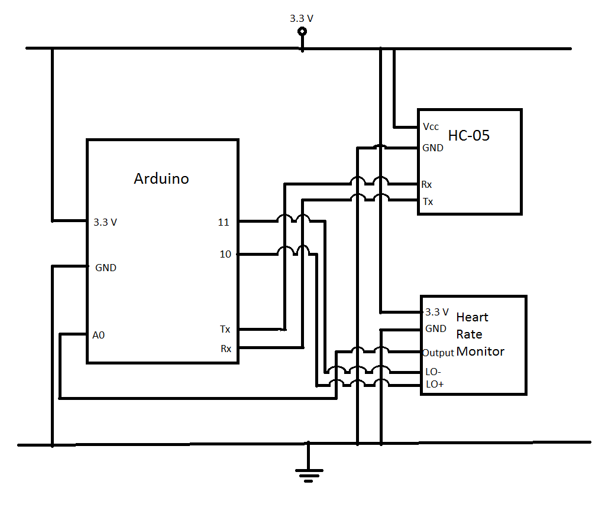

# Heart-Rate-Monitor
## Created By: Konstantinos Keramaris, Theodwros Antonaros

This is our implemetation of a heart rate monitor using:
1. Arduino Uno Board
2. HC-05 Bluetooth module
3. AD8232 Heart Rate Monitor

### Schematics

User must add the pads according to the picture
(The closer to the heart the pads are, the better the measurement)

### Android Application
#### Scan:
User Scans for paired devices and selects HC-05 module  

#### Main Menu (Cardiograph):  
After uses selects the device, the android application connects to the bluetooth module and user has for options:  
* Start: For starting the test
* Show: For showing the test that has been taken
* Save: For saving the test
* History: For showing the history
The test lasts for arround 8 seconds. The arduino onboard led blinks while the test is been taken and it stops blinking when it is finished.  
Beats per minute is also displayed. If bpm is bellow 60 or above 100 a warning message is displayed

  
#### History:  
User can see the saved tests, with chronological order  
  
#### Android Libraries Used:  
[Bluetooth 1.2.4](https://github.com/omaflak/Bluetooth-Library)  
[Android GraphView](http://www.android-graphview.org/)
